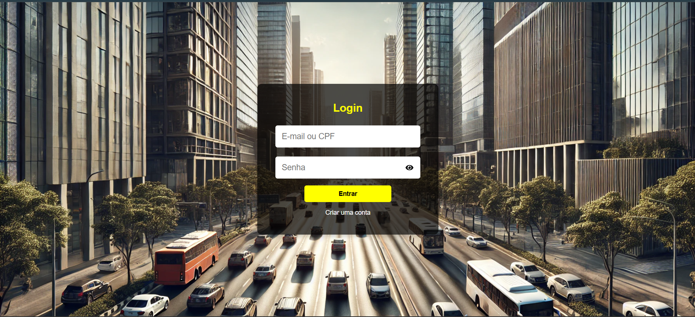
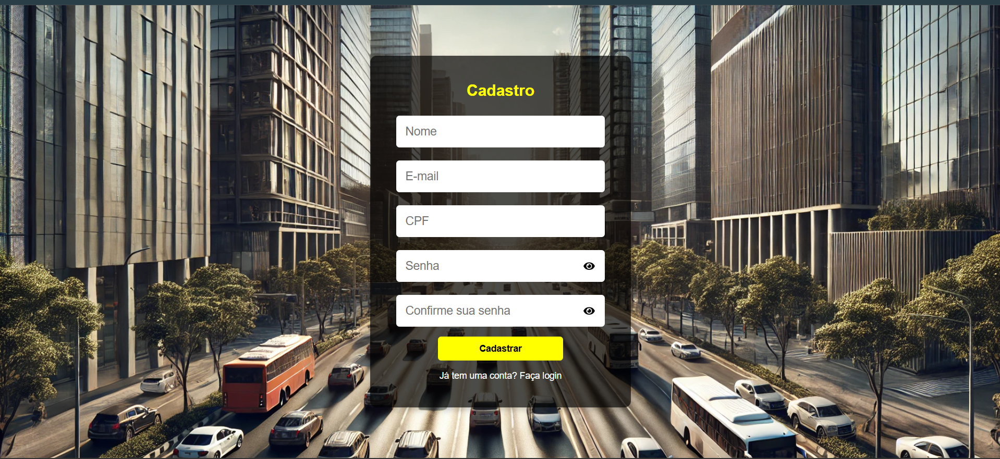
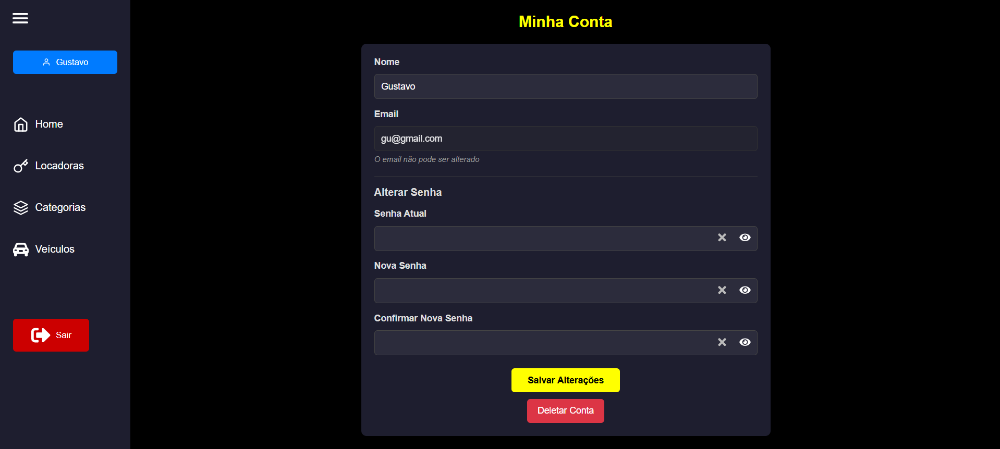
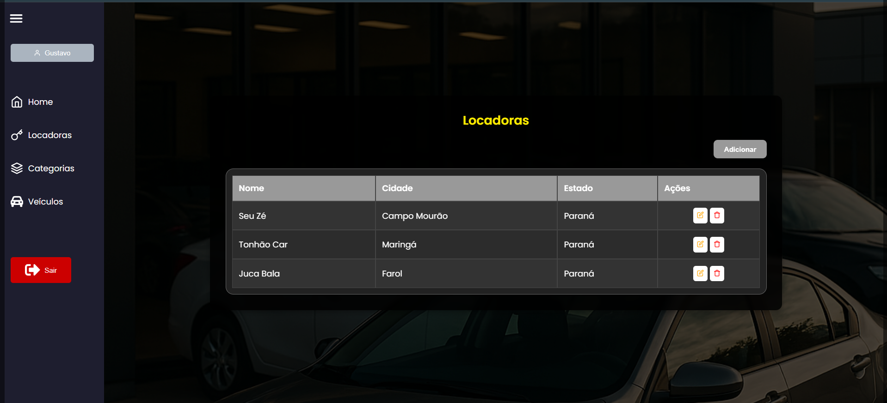
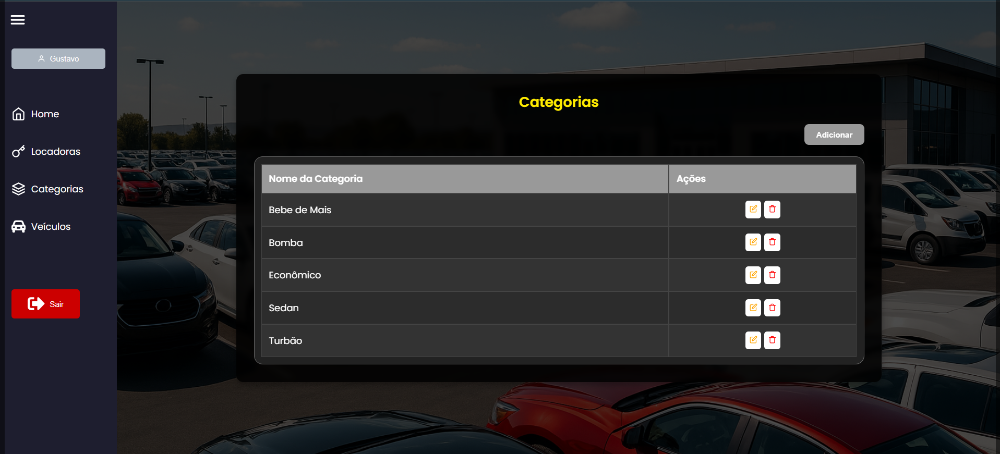
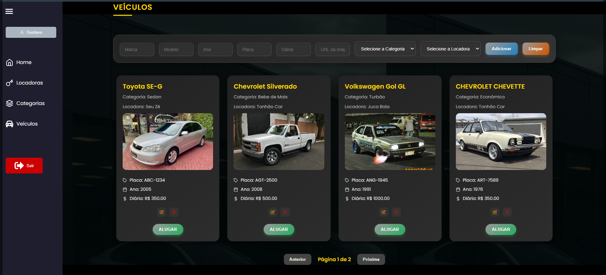

# ALUGA AÍ ZÉ  - SISTEMA DE ALUGUÉIS DE CARRO

📋 Sobre o Projeto
Aluga Aí Zé, é um sistema onde permite cadastrar categorias, locadoras e veículos. 
Em si, possui somente o usuário ADMIN, que pode cadastrar tudo e alugar o veículo, mas futuramente, permite gerenciar uma separação entre ADMIN e CLIENTE, onde o CLIENTE, terá acesso somente a tela de alugar veículos, oque não pode ser desenvolvido no momento. 

### TELAS DESENVOLVIDAS 

- LOGIN E CADASTRO

- HOME PADRÃO 

- MINHA CONTA

- CATEGORIAS E LOCADORAS PADRÕES

- VEÍCULOS 

🛠️ Tecnologias Utilizadas

## Backend
- Node.js
- Express
- TypeScript
- MySQL com Sequelize
- JWT para autenticação
- Bcrypt para criptografia
- Jest para testes
- Dotenv para variáveis de ambiente

## Frontend
- React
- TypeScript
- Vite
- Context API
- React Router
- Axios
- Lucide React para ícones
- CSS Modules